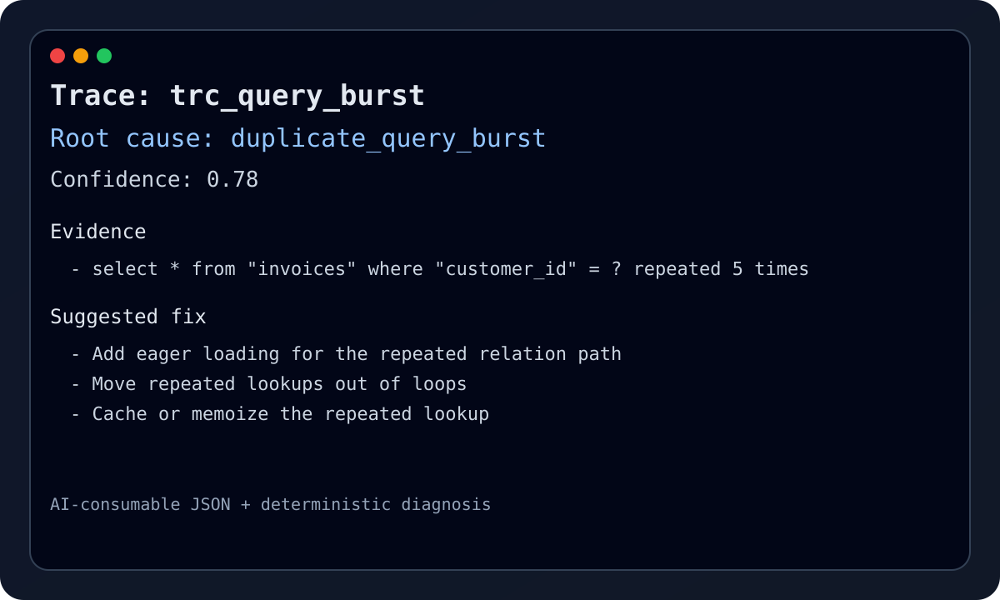

# Query Pathology

## Raw Symptom

`GET /invoices` executes the same query five times in one request.



## `root_cause` Output

```text
Trace: trc_query_burst
Root cause: duplicate_query_burst
Confidence: 0.78

Summary: The same query fingerprint is being repeated in a short period of time.

Evidence
- select * from "invoices" where "customer_id" = ? repeated 5 times

Likely files
- /app/Http/Controllers/InvoiceController.php

Suggested fix
- Add eager loading for the repeated relation path if this query happens inside a collection render.
- Move repeated lookups out of loops and batch them before rendering or serialization.
- Cache or memoize the repeated lookup when the same fingerprint is executed many times in one trace.

Repro
- {"method":"GET","uri":"/invoices","query_fingerprint":"select * from \"invoices\" where \"customer_id\" = ?","query_count":5}
```

## Why This Was Classified

- The trace contains `query_pathology_suspected`, which is the deterministic signal for query diagnosis.
- The category is `duplicate_query_burst` because the repeated fingerprint crosses the configured duplicate threshold without needing N+1 heuristics.
- The worst-offender frame is enough to surface a likely file even when the rest of the stack is noise.

## Suggested Fixes

- Batch or memoize the repeated lookup.
- Add eager loading if the repetition comes from rendering a collection.
- Keep this fixture as a regression case for duplicate bursts that should not be re-labeled as N+1.

## Reference

- Fixture: `docs/incidents/fixtures/query-pathology.trace.json`
- Snapshot: `docs/incidents/snapshots/query-pathology.diagnosis.json`
