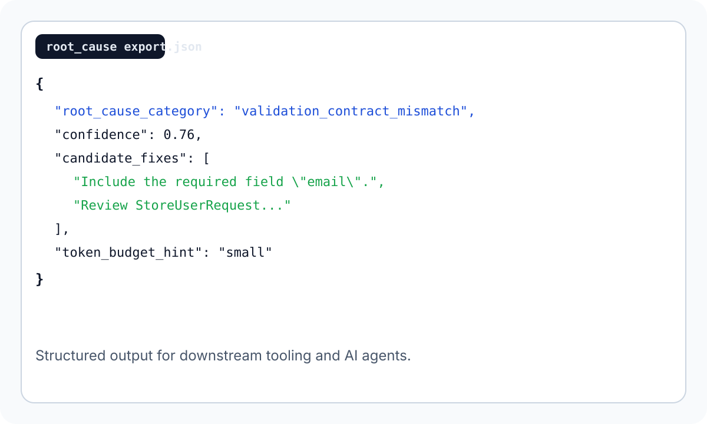

# Quickstart

## Install

```bash
composer require noir4y/laravel-root-cause
php artisan root-cause:install
```

`ROOT_CAUSE_ENABLED` defaults to `true` in `APP_ENV=local` and `false` elsewhere. Set it explicitly before capturing traces in staging or production-like environments.

## Trigger a Diagnosis

Send a request that produces a validation failure, exception, or repeated query pattern. Then inspect the latest trace:

```bash
php artisan root-cause:trace latest
php artisan root-cause:failed-request
php artisan root-cause:query-pathology
```

## Export JSON

```bash
php artisan root-cause:export latest --format=json
php artisan root-cause:export latest --path=storage/app/root-cause/latest-export.json
```

The JSON export is the stable interface for downstream tools and AI agents.

## Example Output

```text
Trace: trc_validation_failure
Root cause: validation_contract_mismatch
Confidence: 0.76
```

```json
{
  "trace_id": "trc_exception",
  "diagnosis": {
    "root_cause_category": "unhandled_exception",
    "confidence": 0.62
  }
}
```

## Demo App

Use the in-repo demo app to reproduce the same incident classes locally:

- [`examples/laravel12-demo`](../examples/laravel12-demo)

## Screenshots

- 
- 
